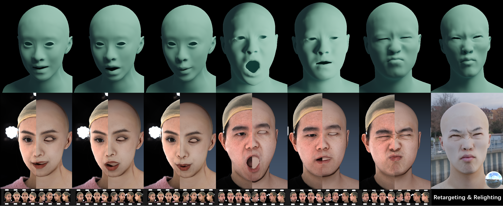

# Topo4D: Topology-Preserving Gaussian Splatting for High-Fidelity 4D Head Capture (ECCV 2024)

<a href='https://arxiv.org/pdf/2406.00440/'></a>
<a href='https://xuanchenli.github.io/Topo4D/'></a>


Official implementation of [Topo4D](https://xuanchenli.github.io/Topo4D/)

---
## Abstract


4D head capture aims to generate dynamic topological meshes and corresponding texture maps from videos, which is widely utilized in movies and games for its ability to simulate facial muscle movements and recover dynamic textures in pore-squeezing. The industry often adopts the method involving multi-view stereo and non-rigid alignment. However, this approach is prone to errors and heavily reliant on time-consuming manual processing by artists. To simplify this process, we propose Topo4D, a novel framework for automatic geometry and texture generation, which optimizes densely aligned 4D heads and 8K texture maps directly from calibrated multi-view time-series images. Specifically, we first represent the time-series faces as a set of dynamic 3D Gaussians with fixed topology in which the Gaussian centers are bound to the mesh vertices. Afterward, we perform alternative geometry and texture optimization frame-by-frame for high-quality geometry and texture learning while maintaining temporal topology stability. Finally, we can extract dynamic facial meshes in regular wiring arrangement and high-fidelity textures with pore-level details from the learned Gaussians. Extensive experiments show that our method achieves superior results than the current SOTA face reconstruction methods both in the quality of meshes and textures.


---
## Install
```bash
pip install -r requirements.txt

# a modified gaussian splatting (+ depth, alpha rendering)
git clone --recursive https://github.com/ashawkey/diff-gaussian-rasterization
pip install ./diff-gaussian-rasterization

# simple-knn
pip install ./simple-knn

# face3d
git clone https://github.com/YadiraF/face3d
cd face3d
cd face3d/mesh/cython
python setup.py build_ext -i 
```

## Prepare Your Data
### Use the example testdata
We prepare [an example sequence](https://drive.google.com/file/d/180jYP3ZCbmQVQR3ppGeeO9MrxAMyGI07/view) for you to test Topo4D, which includes the whole sequence of the low resolution 24-view images and corresponding faceparsing masks, some key frames of the 4K images for you to generate 8K textures, the camera calibration, and the startup model.

### Process your own data
Since our method can be directly extended to any capture system, you can directly appply Topo4D on your own multi-view sequences. Please refer to the example sequence to arrange the directory structure, and modify the code for reading your data.

We use the off-the-shelf [face parsing method](https://github.com/hhj1897/face_parsing) to generate facial region masks.

We read the camera calibration from the [metashape](https://www.agisoft.com/) xml structure, you need to modify the code if you want to use a different format.

Topo4D can be applied to arbitrary topology and doesn't need to tune the parameters for different identities. However, due to the use of specific [facial region partitions](./assets/facial_regions.pkl), we strongly recommend that you directly use the same topology as ours to avoid creating facial partitions by yourself. 

In addition, we suggest that you adjust the scale of the startup mesh to be similar to the example we provided, so that there is no need to finetune hyperparameters such as learning rate.


## Testing
### Optimize geometry only
```bash
python train.py --input_dir "input low resolution data root" --output_dir "your output root" --exp "experiment name" --seq "sequence name"
```
### Optimize texture and geometry
```bash
python train.py --input_dir "input low resolution data root" --output_dir "your output root" --exp "experiment name" --seq "sequence name" --dense_input_dir "input high resolution data root" --gen_tex --tex_res 8192
```

## Acknowledgement
This work is built on awesome research works and open-source projects, thanks a lot to all the authors.
- [3DGS](https://github.com/graphdeco-inria/gaussian-splatting) and [diff-gaussian-rasterization](https://github.com/graphdeco-inria/diff-gaussian-rasterization)
- [Dynamic3DGaussians](https://github.com/JonathonLuiten/Dynamic3DGaussians)
- [diff-gaussian-rasterization modified by Jiaxiang Tang](https://github.com/ashawkey/diff-gaussian-rasterization)
- [Face3D](https://github.com/yfeng95/face3d)
- [Face Parsing](https://github.com/hhj1897/face_parsing)

---
## Citation	
If our work is useful for your research, please consider citing:
```
@inproceedings{li2025topo4d,
  title={Topo4D: Topology-Preserving Gaussian Splatting for High-fidelity 4D Head Capture},
  author={Li, Xuanchen and Cheng, Yuhao and Ren, Xingyu and Jia, Haozhe and Xu, Di and Zhu, Wenhan and Yan, Yichao},
  booktitle={European Conference on Computer Vision},
  pages={128--145},
  year={2025},
  organization={Springer}
}
```
